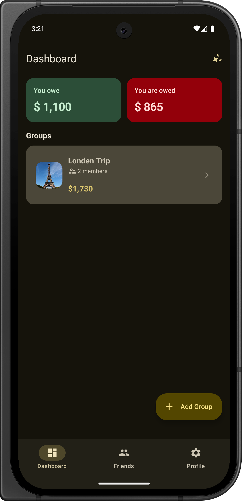
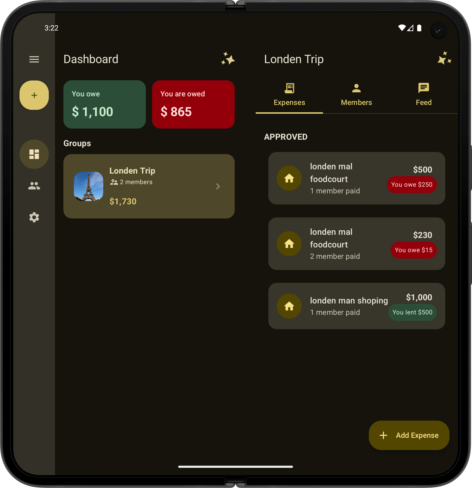
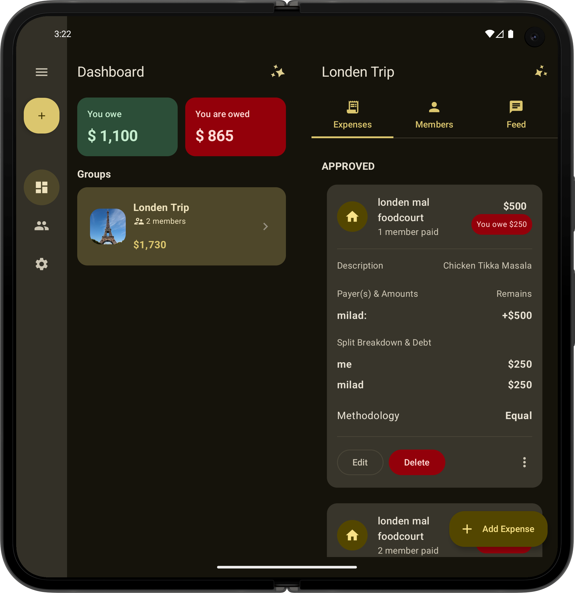
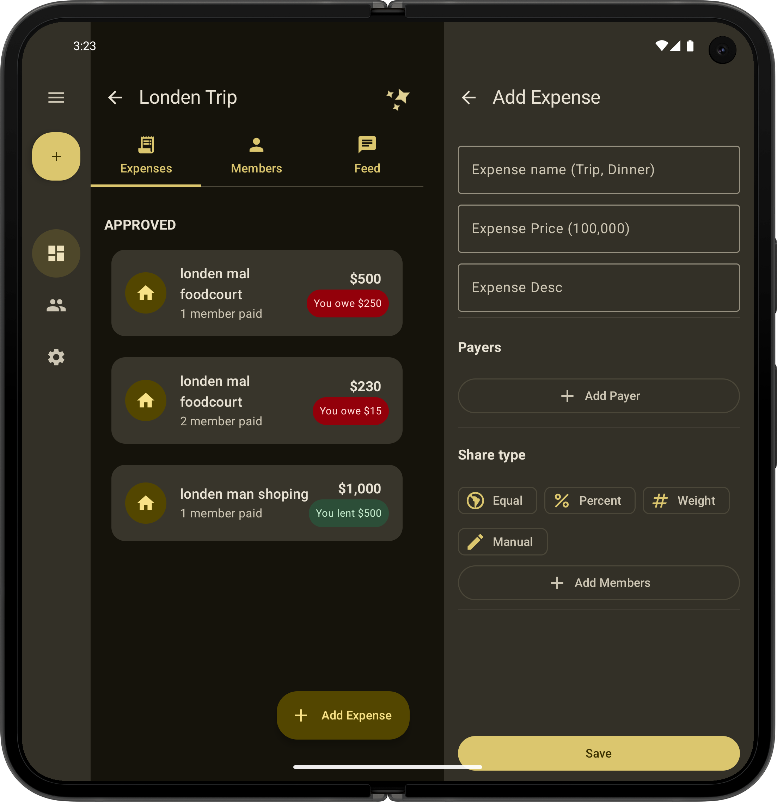

# 🚀 ExpenseShare (Compose Multiplatform + Ktor Server)

**ExpenseShare** is a **Compose Multiplatform (CMP)** application designed for seamless group expense sharing.  
Users can create groups, add friends, record transactions, and the system automatically calculates how much each member owes or is owed.  
All data is synced through the backend — the app currently uses **no local database**.

AI-powered features will be added later to assist with categorization, analysis, and smart recommendations.

This repository includes both the **CMP client** and the **Ktor backend**.

## 📸 Screenshots

Here is a glimpse of **ExpenseShare** in action across different platforms:

|                               Group List                                |                               Two pane view (Canonical layouts)                              |                               List of transaction                                |                                 Add Transaction                                 |                                       Desktop                                        |
|:-----------------------------------------------------------------------:|:-----------------------------------------------------------------------:|:-----------------------------------------------------------------------:|:-----------------------------------------------------------------------:|:------------------------------------------------------------------------------------:|
|  |  |  |  |  |

---

## ⭐ Core Features

### 🔹 Group Management
- Create and manage groups  
- Add members  
- View group activity and balances  

### 🔹 Friends Management
- Add and manage friends  
- Create groups using your friend list  
- Friend relationships synced with the backend  

### 🔹 Transactions
- Add expenses  
- Select payer  
- Split cost among group members  
- All members can add new transactions  

### 🔹 Automatic Settlement Calculation
- Real-time debt/credit calculation  
- Clear overview of who owes whom  
- Group updates propagate to all members  

### 🔹 Future Enhancements
- AI-based transaction classification  
- Smart settlement suggestions  
- Expense pattern insights  


## 🧱 Architecture Overview

### Client – Compose Multiplatform

Supported platforms:

- Android  
- iOS  
- Desktop (JVM: Windows, macOS, Linux)  
- Web (WASM)  

### Tech Stack
- Clean Architecture  
- MVI  
- Compose Multiplatform  
- Koin  
- Coroutines + Flow  
- No local DB (server = source of truth)

### Project Structure

```
/composeApp
├── commonMain
├── androidMain
├── iosMain
├── jvmMain
└── wasmJsMain
```

- **commonMain** → Shared UI & domain logic  
- **androidMain** → Android-specific  
- **iosMain** → iOS integration  
- **jvmMain** → Desktop  
- **wasmJsMain** → Web (WASM)

---

## 🖥️ Server – Ktor Backend

The backend manages all persistence & logic:

- Ktor Server  
- PostgreSQL  
- Exposed ORM  
- Authentication  
- Groups, Friends, Transactions APIs  
- Settlement calculation  

Folder:
```
/server
```

---

## ▶️ Running the Project

### Desktop (JVM)
```
./gradlew jvmRun -DmainClass=org.milad.expense_share.MainKt --quiet
```

### Server
```
./gradlew :server:run
```

### Tests (Kotest)
```
./gradlew kotest
```

### Web (WASM)
```
./gradlew :composeApp:wasmJsBrowserDevelopmentRun
```

---

## 💡 Why ExpenseShare Matters

This project demonstrates:

- Production-grade Compose Multiplatform  
- Clean modular design  
- Full backend with Ktor + PostgreSQL  
- Multi-platform targeting (Android/iOS/Web/Desktop)  
- Extendable architecture for upcoming AI features  

A strong showcase of modern Kotlin ecosystem practices.
