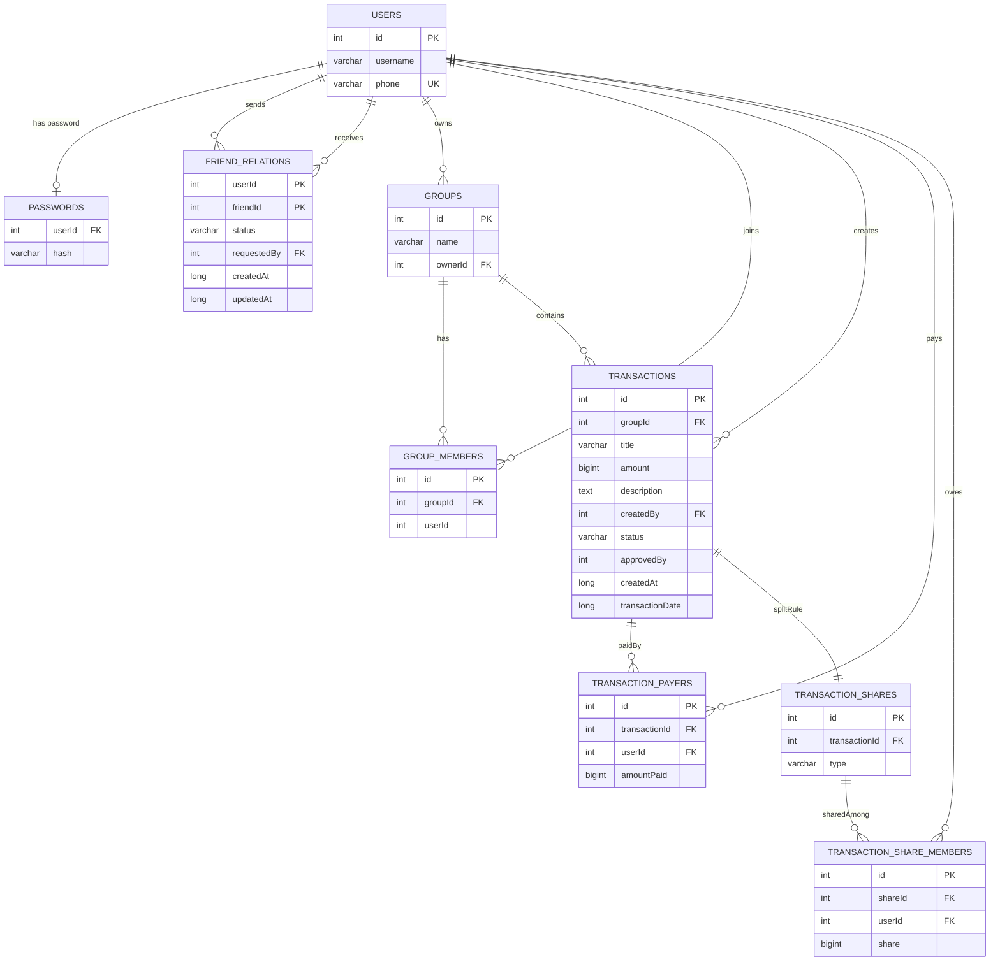

# 🗄️ ExpenseShare — Database Documentation

> **Stack:** PostgreSQL · Jetbrains Exposed ORM · HikariCP Connection Pool  
> 
---

## 📐 Entity Relationship Diagram



---

## 📋 Table Reference

### `users`
Stores registered users. Phone number is the primary identifier used for login and friend requests.

| Column     | Type           | Constraints            | Notes                          |
|------------|----------------|------------------------|--------------------------------|
| `id`       | `INT`          | `PK`, `AUTO_INCREMENT` | Internal numeric ID            |
| `username` | `VARCHAR(100)` | `NOT NULL`             | Display name                   |
| `phone`    | `VARCHAR(20)`  | `NOT NULL`, `UNIQUE`   | Used for login & friend lookup |

---

### `passwords`
Stores BCrypt-hashed passwords separately from user profile data.

| Column   | Type           | Constraints     | Notes                     |
|----------|----------------|-----------------|---------------------------|
| `userId` | `INT`          | `FK → users.id` | ⚠️ No Primary Key defined |
| `hash`   | `VARCHAR(255)` | `NOT NULL`      | BCrypt hash               |

---

### `friend_relations`
Bidirectional friendship table with status tracking. Uses a composite primary key `(userId, friendId)` to prevent duplicate entries.

| Column        | Type          | Constraints                   | Notes                                           |
|---------------|---------------|-------------------------------|-------------------------------------------------|
| `userId`      | `INT`         | `PK`, `FK → users.id CASCADE` | The sender side                                 |
| `friendId`    | `INT`         | `PK`, `FK → users.id CASCADE` | The receiver side                               |
| `status`      | `VARCHAR(20)` | `NOT NULL`                    | `PENDING` / `ACCEPTED` / `REJECTED` / `BLOCKED` |
| `requestedBy` | `INT`         | `FK → users.id`               | Tracks who initiated the request                |
| `createdAt`   | `BIGINT`      | `NOT NULL`                    | Unix timestamp (ms)                             |
| `updatedAt`   | `BIGINT`      | `NOT NULL`                    | Unix timestamp (ms)                             |

**Indexes:** `status`, `userId`, `friendId` (all non-unique)

---

### `groups`
Expense groups. Each group has exactly one owner who manages approvals and membership.

| Column    | Type           | Constraints            | Notes                          |
|-----------|----------------|------------------------|--------------------------------|
| `id`      | `INT`          | `PK`, `AUTO_INCREMENT` |                                |
| `name`    | `VARCHAR(100)` | `NOT NULL`             | Group display name             |
| `ownerId` | `INT`          | `FK → users.id`        | ⚠️ No `ON DELETE` rule defined |

---

### `group_members`
Junction table linking users to groups. Allows fetching all members of a group or all groups of a user.

| Column    | Type  | Constraints              | Notes                   |
|-----------|-------|--------------------------|-------------------------|
| `id`      | `INT` | `PK`, `AUTO_INCREMENT`   |                         |
| `groupId` | `INT` | `FK → groups.id CASCADE` |                         |
| `userId`  | `INT` | `FK → users.id`          | ⚠️ No index, no CASCADE |

---

### `transactions`
Core expense records. Status starts as `PENDING` unless the creator is the group owner.

| Column            | Type           | Constraints              | Notes                                               |
|-------------------|----------------|--------------------------|-----------------------------------------------------|
| `id`              | `INT`          | `PK`, `AUTO_INCREMENT`   |                                                     |
| `groupId`         | `INT`          | `FK → groups.id CASCADE` |                                                     |
| `title`           | `VARCHAR(255)` | `NOT NULL`               |                                                     |
| `amount`          | `BIGINT`       | `NOT NULL`               | Stored as integer minor units. Custom `Amount` type |
| `description`     | `TEXT`         | `NOT NULL`               |                                                     |
| `createdBy`       | `INT`          | `FK → users.id`          |                                                     |
| `status`          | `ENUM`         | `NOT NULL`               | `PENDING` / `APPROVED` / `REJECTED`                 |
| `approvedBy`      | `INT`          | `NULLABLE`               | ⚠️ No FK constraint                                 |
| `createdAt`       | `BIGINT`       | `NOT NULL`               | Unix timestamp (ms)                                 |
| `transactionDate` | `BIGINT`       | `NOT NULL`               | Unix timestamp (ms)                                 |

> 💡 **Amount type:** All monetary values are stored as `BIGINT` (integer minor units) to avoid floating-point precision issues. This is intentional and correct.

---

### `transaction_payers`
Records who paid how much for a transaction. Supports split payments (multiple payers per transaction).

| Column          | Type     | Constraints                    | Notes                             |
|-----------------|----------|--------------------------------|-----------------------------------|
| `id`            | `INT`    | `PK`, `AUTO_INCREMENT`         |                                   |
| `transactionId` | `INT`    | `FK → transactions.id CASCADE` | ⚠️ No index                       |
| `userId`        | `INT`    | `FK → users.id`                |                                   |
| `amountPaid`    | `BIGINT` | `NOT NULL`                     | Must sum to `transactions.amount` |

---

### `transaction_shares`
Defines the split rule for a transaction. Each transaction has exactly one share strategy.

| Column          | Type          | Constraints                    | Notes                                     |
|-----------------|---------------|--------------------------------|-------------------------------------------|
| `id`            | `INT`         | `PK`, `AUTO_INCREMENT`         |                                           |
| `transactionId` | `INT`         | `FK → transactions.id CASCADE` | ⚠️ No index, no UNIQUE constraint         |
| `type`          | `VARCHAR(20)` | `NOT NULL`                     | `Equal` / `Percent` / `Weight` / `Manual` |

---

### `transaction_share_members`
The per-user share amount for each transaction. The actual debt records.

| Column    | Type     | Constraints                          | Notes                   |
|-----------|----------|--------------------------------------|-------------------------|
| `id`      | `INT`    | `PK`, `AUTO_INCREMENT`               |                         |
| `shareId` | `INT`    | `FK → transaction_shares.id CASCADE` | ⚠️ No index             |
| `userId`  | `INT`    | `FK → users.id`                      |                         |
| `share`   | `BIGINT` | `NOT NULL`                           | The user's debt portion |

---

## 🔗 Relationship Summary

| Relationship                                       | Type                | Details                                         |
|----------------------------------------------------|---------------------|-------------------------------------------------|
| `users` → `passwords`                              | One-to-One          | Each user has exactly one password record       |
| `users` ↔ `friend_relations`                       | Many-to-Many (self) | Bidirectional; composite PK prevents duplicates |
| `users` → `groups`                                 | One-to-Many         | A user can own many groups                      |
| `users` ↔ `groups` (via `group_members`)           | Many-to-Many        | A user can be in many groups                    |
| `groups` → `transactions`                          | One-to-Many         | A group can have many transactions              |
| `transactions` → `transaction_payers`              | One-to-Many         | A transaction can have multiple payers          |
| `transactions` → `transaction_shares`              | One-to-One          | Each transaction has one split rule             |
| `transaction_shares` → `transaction_share_members` | One-to-Many         | A split rule is applied to multiple users       |

---

## 🔧 Connection Pool (HikariCP)

| Parameter              | Value                         | Notes                                     |
|------------------------|-------------------------------|-------------------------------------------|
| `maximumPoolSize`      | `10`                          | Max concurrent DB connections             |
| `isAutoCommit`         | `false`                       | Transactions managed manually via Exposed |
| `transactionIsolation` | `TRANSACTION_REPEATABLE_READ` | Prevents dirty and non-repeatable reads   |

---

## 📁 Relevant Source Files

```
server/src/main/kotlin/org/milad/expense_share/
├── data/
│   ├── db/
│   │   ├── DatabaseFactory.kt          # HikariCP setup, SchemaUtils.create()
│   │   └── table/
│   │       ├── Users.kt
│   │       ├── Passwords.kt
│   │       ├── FriendRelations.kt
│   │       ├── Groups.kt
│   │       ├── GroupMembers.kt
│   │       └── Transactions.kt         # Also contains TransactionPayers,
│   │                                   # TransactionShares, TransactionShareMembers
│   └── repository/
│       ├── UserRepositoryImpl.kt
│       ├── FriendRepositoryImpl.kt
│       ├── GroupRepositoryImpl.kt
│       └── TransactionRepositoryImpl.kt
└── resources/
    └── application.conf                # Port, JWT config (credentials hardcoded)
```