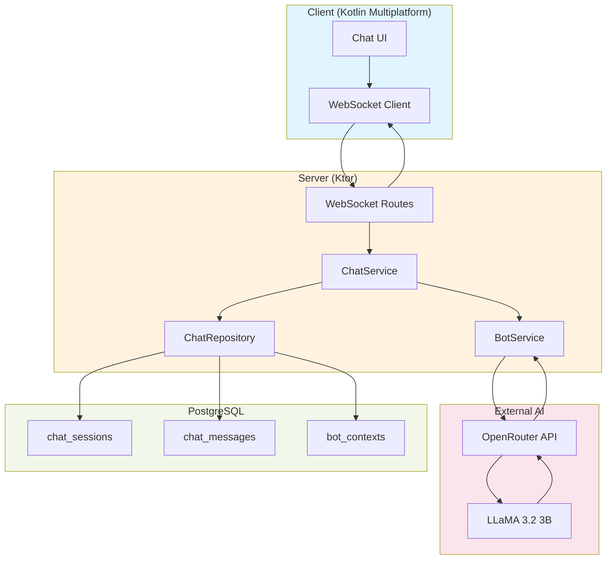
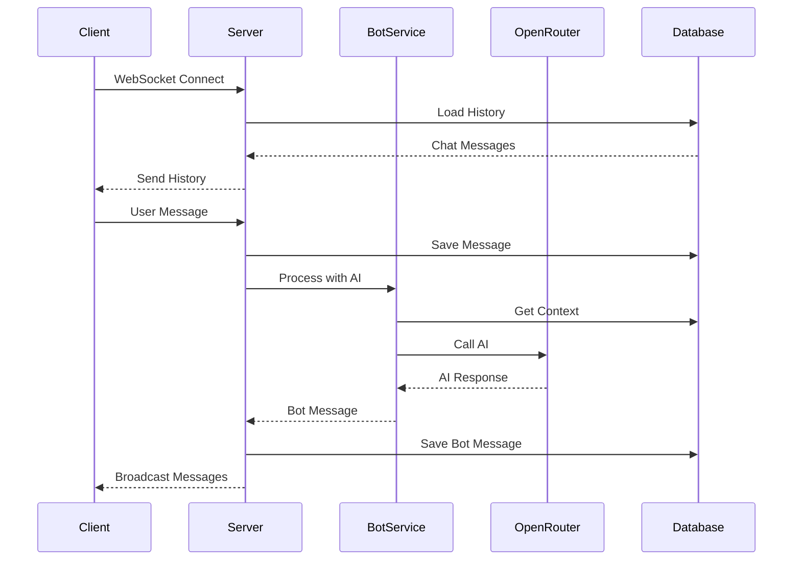
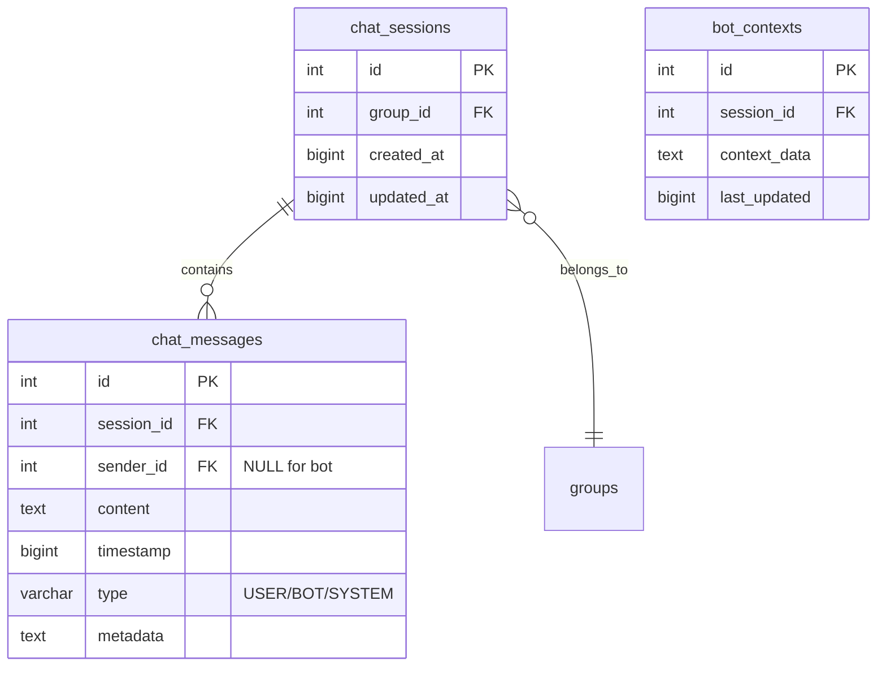
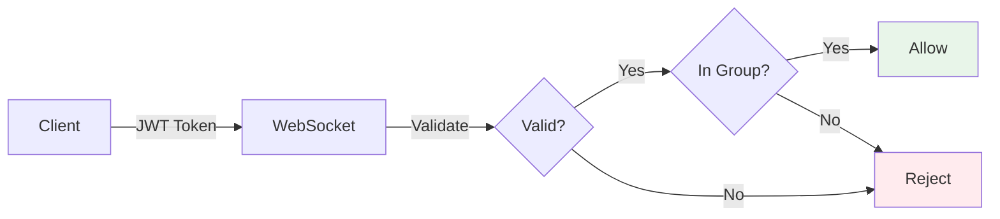

# 🤖 Chat & AI Bot System - Server

Real-time chat system with AI-powered bot for ExpenseShare server.

---

## 🏗️ Architecture



---

## 🔄 Communication Flow



---

## 💾 Database Schema


---

## 📁 Project Structure

```
server/src/main/kotlin/org/milad/expense_share/
├── data/
│   ├── db/table/
│   │   ├── ChatSessions.kt          # Session table
│   │   ├── ChatMessages.kt          # Messages table
│   │   └── BotContexts.kt           # AI context
│   ├── models/
│   │   ├── ChatMessage.kt           # Message model
│   │   └── ChatSession.kt           # Session model
│   └── repository/
│       └── ChatRepositoryImpl.kt    # Data access
│
├── domain/
│   ├── repository/
│   │   └── ChatRepository.kt        # Repository interface
│   └── service/
│       ├── ChatService.kt           # Business logic
│       └── BotService.kt            # AI integration
│
├── presentation/
│   └── chat/
│       ├── chatRoutes.kt            # WebSocket routes
│       └── model/
│           └── SendMessageRequest.kt
│
└── application/
    ├── configureWebSockets.kt       # WebSocket config
    └── Application.kt               # App entry point
```

---

## 🔒 Security



- ✅ JWT authentication required
- ✅ Group membership validated
- ✅ Message sender verified
- ✅ SQL injection prevented (ORM)

---

## 🛠️ Troubleshooting

### **Bot Not Responding**

```bash
# Check API key
echo $OPENROUTER_API_KEY

# Check logs
tail -f logs/application.log

# Test API directly
curl https://openrouter.ai/api/v1/chat/completions \
  -H "Authorization: Bearer $OPENROUTER_API_KEY" \
  -H "Content-Type: application/json" \
  -d '{"model":"meta-llama/llama-3.2-3b-instruct:free","messages":[{"role":"user","content":"Hello"}]}'
```

### **Connection Issues**

```bash
# Verify server running
curl http://localhost:8082

# Check port
lsof -i :8082

# Check database
psql -U postgres -d expenseshare -c "\dt"
```

---

## 📊 Performance

| Metric | Target | Status |
|--------|--------|--------|
| WebSocket Connect | < 200ms | ✅ ~150ms |
| Bot Response | < 3s | ✅ ~2s |
| Message Delivery | < 100ms | ✅ ~50ms |

---

## 🔮 Future

- [ ] Multi-language support
- [ ] Voice messages
- [ ] Message reactions
- [ ] File attachments

---

## 📚 Resources

- **OpenRouter:** https://openrouter.ai/docs
- **Ktor WebSockets:** https://ktor.io/docs/websocket.html
- **Main Project:** ../README.md

---

**Built with Kotlin, Ktor & AI** 🚀
